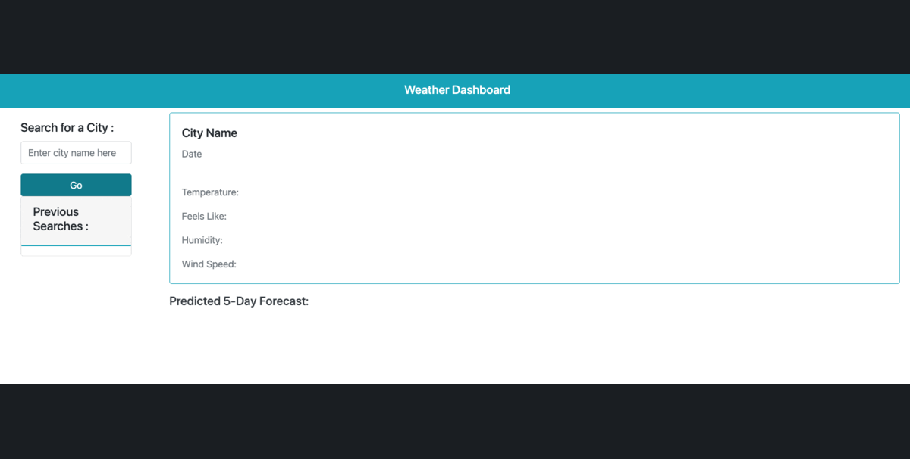

# weather-app

## Description

This weather dashboard runs in the browser and feature dynamically updated HTML and CSS, using the 5 Day Weather Forecast to retrieve weather data for cities.

## Table of Contents:

- [Installation](#installation)
- [Usage](#usage)
- [Credits](#credits)
- [License](#license)

## Installation

Go to [webpage]() to navigate through the app

## Usage

- Open the app on the browser
- Type the name of the city you want to get reults for
- View the current weather and the predicted forecast for the following 4 days.
- Select cities from your history to view the most recent weather and predicted forecast.

## Credits

- [Open Weather API](https://openweathermap.org/)
- [UCLA Extension Bootcamp](https://www.uclaextension.edu/?gclid=Cj0KCQiAgribBhDkARIsAASA5btdbwAz8x25r3b1deoRNIGxfkPFL11rAQMuCgQ7HYiqBH8CLr9CgLoaAktlEALw_wcB&gclsrc=aw.ds)

## License

Please refer to the LICENSE in the repo.

---
